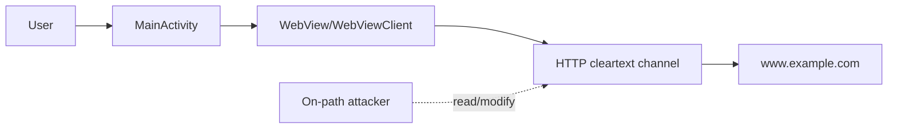

# Report Writer Pack for Overleaf

Use this as the source package for writing `report.pdf` in the official USENIX template. The report should be no more than 2 pages and should cover Part A only.

## Required Report Position

Primary vulnerability:

> The APK permits cleartext traffic and loads an HTTP URL in a WebView, enabling an on-path attacker to observe or modify WebView HTTP traffic.

Do not write the report as several unrelated vulnerabilities. The report may mention SSL-error proceed and the always-true HostnameVerifier as supporting evidence, but the primary claim must remain cleartext traffic plus HTTP WebView loading.

## Target and Scope Facts

- Assignment: INFO5995 Assignment 2 Part A.
- APK: `a2_case1.apk`.
- Package: `com.example.mastg_test0019`.
- Graded vulnerability class: insecure network transport/configuration enabling MITM-style attacks.
- Analysis type: static decompilation and teammate screenshot/evidence review.
- Runtime MITM proof: not currently claimed.

## Code and Config Facts

| Fact | Location | Meaning |
|---|---|---|
| `android.permission.INTERNET` declared | `export/resources/AndroidManifest.xml:13` | App can perform network traffic. |
| `android:usesCleartextTraffic="true"` set | `export/resources/AndroidManifest.xml:26` | App allows cleartext HTTP traffic. |
| `MainActivity` is launcher | `export/resources/AndroidManifest.xml:30-36` | Vulnerable path is reachable during normal app launch. |
| WebView is obtained and WebViewClient attached | `export/sources/com/example/mastg_test0019/MainActivity.java:31-32` | WebView is the relevant network-rendering component. |
| `onReceivedSslError` calls `sslErrorHandler.proceed()` | `MainActivity.java:34-35` | Unsafe TLS failure handling; supporting evidence. |
| WebView loads `http://www.example.com` | `MainActivity.java:38` | Primary HTTP cleartext execution path. |
| HostnameVerifier returns `true` | `MainActivity.java:39-43` | Weak supporting evidence only; no visible binding to request path. |

## System Model Facts

Components:

- E1 User: launches app and consumes WebView-rendered content.
- P1 MainActivity: initializes layout and WebView.
- P2 WebView/WebViewClient: fetches and renders remote web content.
- C1 HTTP cleartext network channel: carries request/response traffic.
- E2 Remote server: `www.example.com`.
- A1 On-path attacker: same Wi-Fi, rogue hotspot, compromised router, or controlled lab proxy.

Trust boundaries:

- TB1: User -> Android app process.
- TB2: App process -> untrusted network.
- TB3: Untrusted network path -> remote server.

Assets:

- AS1: WebView content authenticity/integrity. Priority: Critical.
- AS2: In-transit request/response confidentiality/integrity. Priority: High.
- AS3: User decision context integrity. Priority: High.

## Attack Path Facts

1. Victim launches the app.
2. `MainActivity` initializes and obtains the WebView.
3. WebView loads `http://www.example.com`.
4. The request leaves the app over HTTP cleartext.
5. An on-path attacker can read the request/response.
6. The attacker can modify the HTTP response.
7. WebView renders modified content inside the app.
8. User may trust attacker-controlled content as app-delivered content.

## Impact Wording

Strong supported impact:

- WebView content integrity/authenticity compromise.
- HTTP request/response confidentiality and integrity loss.
- Possible content injection, misleading content, or phishing-style deception inside app UI.

Bounded limitation:

- Static evidence does not show credentials, session tokens, personal data, authenticated API traffic, backend compromise, or account takeover.

## Mitigation Facts

Concrete fixes:

- Replace `http://www.example.com` with a valid HTTPS endpoint.
- Set `android:usesCleartextTraffic="false"`.
- Add restrictive Network Security Config with cleartext denied by default.
- Replace `sslErrorHandler.proceed()` with fail-closed behavior such as `sslErrorHandler.cancel()`.
- Remove or avoid permissive HostnameVerifier logic; rely on platform-default certificate and hostname validation.
- Optionally restrict WebView navigation to trusted HTTPS origins.

Why fixes work:

- HTTPS protects confidentiality, integrity, and endpoint authentication in transit.
- Disabling cleartext prevents accidental HTTP regressions.
- Fail-closed TLS handling prevents rendering attacker-controlled content under invalid certificates.

Verification plan:

- Static: no `usesCleartextTraffic="true"`, no `loadUrl("http://...")`, no `sslErrorHandler.proceed()`.
- Dynamic: local proxy shows no HTTP request; invalid certificate cases are blocked; normal app flow still loads over HTTPS.

## Recommended 2-Page Structure

1. Abstract: 4-5 sentences summarizing target, vulnerability, impact, mitigation.
2. Scope and decompilation: 1 short paragraph.
3. System/threat model: 1 paragraph plus a compact figure.
4. Evidence: small table with manifest and `MainActivity` lines.
5. Impact: concise attack path and bounded impact.
6. Mitigation: bullet list plus why it reduces risk.
7. Conclusion: 2-3 sentences.

## Suggested Figure

## Suggested Evidence Table

| Evidence | Security meaning |
|---|---|
| `AndroidManifest.xml:26` sets `usesCleartextTraffic="true"` | App permits cleartext HTTP traffic. |
| `MainActivity.java:38` loads `http://www.example.com` | App actively uses cleartext HTTP in WebView. |
| `MainActivity.java:34-35` proceeds after SSL error | Supporting unsafe TLS error handling. |

## Suggested Final Sentence

By enforcing HTTPS, disabling cleartext transport, and rejecting TLS validation failures, the app removes the demonstrated MITM path and protects WebView-rendered content from silent network tampering.

