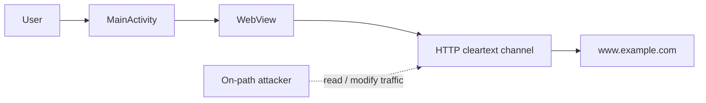

# Insecure Cleartext WebView Transport in `a2_case1.apk`

## Abstract

We analysed the provided Android APK `a2_case1.apk` (`com.example.mastg_test0019`) for the network transport weakness required in Assignment 2 Part A. Static decompilation shows that the application permits cleartext traffic in its manifest and loads `http://www.example.com` directly inside an Android `WebView`. This creates a realistic man-in-the-middle risk: an on-path attacker can observe or modify the HTTP request and response before the content is rendered inside the app. The appropriate mitigation is to enforce HTTPS, disable cleartext traffic, and fail closed on certificate or hostname validation errors.

## 1. Scope and Decompilation

The target was the provided APK `a2_case1.apk`. Following the Assignment 1 workflow, the APK was decompiled and the resulting manifest, resources, and Java sources were inspected for network permissions, cleartext transport settings, WebView behaviour, and TLS validation handling. The relevant decompiled artifacts are `export/resources/AndroidManifest.xml` and `export/sources/com/example/mastg_test0019/MainActivity.java`.

This report focuses only on the intended Part A class: insecure network transport/configuration enabling MITM-style attacks. Other Android vulnerability classes are out of scope for this Part A claim.

## 2. System and Threat Model

The app's relevant flow is small. A user launches the app, `MainActivity` initializes the UI, obtains a `WebView`, attaches a `WebViewClient`, and loads remote web content. The protected assets are the integrity and authenticity of the content rendered inside the WebView, the confidentiality and integrity of request/response data in transit, and the user's decision context when viewing app-delivered content.

The realistic attacker is an on-path network attacker, such as a same-Wi-Fi attacker, rogue hotspot operator, compromised router, or controlled local proxy in a lab. The key trust boundary is where app traffic leaves the Android app process and crosses an untrusted network path. Because the channel is HTTP cleartext, the network path does not provide confidentiality, response integrity, or server authentication.

## 3. Vulnerability Evidence

The manifest declares network access and explicitly permits cleartext traffic:

- `AndroidManifest.xml:13` declares `android.permission.INTERNET`.
- `AndroidManifest.xml:26` sets `android:usesCleartextTraffic="true"`.

The launcher activity then loads HTTP content into a WebView:

- `MainActivity.java:31-32` obtains the WebView and attaches a WebViewClient.
- `MainActivity.java:38` calls `webView.loadUrl("http://www.example.com")`.

This combination is the root cause: cleartext traffic is permitted by app configuration and the app actively uses a cleartext HTTP URL in a user-visible WebView path. The same class also contains unsafe TLS-related code: `onReceivedSslError` calls `sslErrorHandler.proceed()` at `MainActivity.java:34-35`. That is supporting evidence of insecure transport handling, although the directly proven vulnerable path is the HTTP WebView load.

## 4. Impact

When the victim opens the app, the WebView requests `http://www.example.com`. Because this request uses HTTP, an on-path attacker can observe the request and response in plaintext. More importantly, the attacker can modify the HTTP response before it reaches the WebView. The modified response is then rendered inside the app, so the user may see attacker-controlled content in a context that appears to be app-delivered.

The strongest supported impact is WebView content integrity compromise, including content injection or misleading content. A secondary impact is exposure and tampering of HTTP request/response data on this path. The static evidence does not show credentials, session tokens, personal data, authenticated API traffic, account takeover, or backend compromise. Therefore, the claim is intentionally bounded to MITM risk over the demonstrated WebView transport path.

## 5. Mitigation

The root-cause fix is to remove the cleartext transport path and enforce authenticated encryption:

- replace `http://www.example.com` with a valid HTTPS endpoint;
- set `android:usesCleartextTraffic="false"`;
- add a restrictive Network Security Config with `cleartextTrafficPermitted="false"`;
- remove `sslErrorHandler.proceed()` and fail closed on TLS errors;
- remove or avoid any permissive `HostnameVerifier`; rely on platform-default certificate and hostname validation;
- validate the fix with a local proxy: the app should emit no cleartext HTTP request, and TLS validation failures should stop the load rather than proceed.

These changes reduce the risk because HTTPS protects confidentiality and integrity in transit, disabling cleartext prevents accidental HTTP regressions, and fail-closed TLS handling prevents silent connection to untrusted endpoints.

## 6. Conclusion

The APK permits cleartext traffic and loads an HTTP URL in a WebView, so a realistic on-path attacker can read or modify content delivered to the app. This compromises WebView content integrity and HTTP transport confidentiality. Enforcing HTTPS, disabling cleartext traffic, and rejecting TLS validation failures directly address the root cause.

