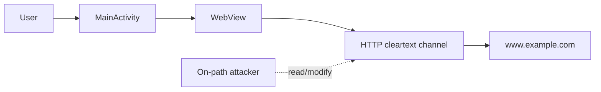

# Part A Report Outline - Rongbang Cheng

Target length: at most 2 pages in the USENIX template.

## Title

Insecure Cleartext WebView Transport in `a2_case1.apk`

## Abstract

One compact paragraph:

- identify target APK and package `com.example.mastg_test0019`;
- state that the app permits cleartext traffic and loads an HTTP URL in a WebView;
- state MITM consequence: on-path attacker can observe or modify WebView traffic;
- state mitigation: enforce HTTPS, disable cleartext traffic, and fail closed on TLS validation errors.

## 1. Introduction and Decompilation Scope

Goal: show compliance with Task 1 and set up the selected vulnerability.

Include:

- target: `a2_case1.apk`;
- decompiled artifacts used: manifest and `MainActivity`;
- Part A scope: insecure network transport/configuration only;
- short tool/process wording: APK was decompiled and statically inspected for manifest settings, WebView usage, and TLS/hostname handling.

Avoid:

- unrelated Android weakness classes;
- broad claims about the whole app.

## 2. System and Threat Model

Goal: earn the 3/3 model row.

Use Sienna's content:

- app process: `MainActivity` and `WebView`;
- network path: HTTP cleartext channel;
- remote host: `www.example.com`;
- attacker: on-path network attacker;
- protected assets: WebView content integrity/authenticity, request/response confidentiality, user decision context;
- trust boundaries: app-to-network and untrusted-network-to-server.

Recommended figure:

## 3. Vulnerability Evidence

Goal: earn the 5/5 vulnerability evidence row.

Core paragraph:

- `AndroidManifest.xml:13` requests `INTERNET`;
- `AndroidManifest.xml:26` sets `android:usesCleartextTraffic="true"`;
- `MainActivity.java:31-38` initializes WebView and loads `http://www.example.com`;
- `MainActivity.java:34-35` calls `sslErrorHandler.proceed()` as supporting unsafe TLS behavior.

Evidence table:

| Evidence | Meaning |
|---|---|
| Manifest `usesCleartextTraffic="true"` | Cleartext traffic is permitted by app config. |
| `webView.loadUrl("http://www.example.com")` | The app actively uses an HTTP transport path. |
| `sslErrorHandler.proceed()` | TLS validation failure would not stop the WebView path. |

## 4. Impact Reasoning

Goal: be concrete and defensible.

Use this chain:

1. Victim opens the app.
2. Launcher `MainActivity` creates the WebView.
3. WebView requests an HTTP URL.
4. Traffic crosses an untrusted network path without encryption or server authentication.
5. On-path attacker can observe or alter the response.
6. Modified response is rendered inside the app's WebView.

Bounded impact wording:

- strong claim: content injection or modification inside WebView;
- secondary claim: disclosure/tampering of HTTP request/response data;
- do not claim: credential theft, account takeover, backend compromise, or live runtime MITM unless further evidence is added.

## 5. Mitigation

Goal: earn the 2/2 mitigation row.

Concrete fixes:

- replace `http://www.example.com` with an HTTPS endpoint;
- set `android:usesCleartextTraffic="false"`;
- add restrictive Network Security Config with `cleartextTrafficPermitted="false"`;
- remove `sslErrorHandler.proceed()` and fail closed on TLS errors;
- remove or replace any permissive `HostnameVerifier` with platform-default hostname validation;
- validate by rerunning the app through a local proxy and confirming no cleartext HTTP request is emitted.

Why it works:

- HTTPS provides confidentiality and integrity in transit;
- disabling cleartext prevents accidental HTTP regressions;
- fail-closed TLS handling prevents users from being silently connected to untrusted endpoints.

## 6. Conclusion

One short paragraph:

- restate final one-sentence claim;
- state the risk is MITM content integrity plus confidentiality on the WebView path;
- state mitigation is straightforward and root-cause aligned.

