# Evidence Capture Notes

## Purpose
This file is used to collect member D's evidence screenshots for the bounded PoC and tutorial Q&A.

## Claim boundary reminder
- We can claim weak generation of authentication-related token material (`sessionToken`) using `java.util.Random`.
- We can claim the token is created after successful login and stored in session-related state.
- We cannot claim a proven downstream token-validation sink.
- We cannot overclaim guaranteed auth bypass, session hijack, or remote takeover.

---

## D01 - Token generation logic
**File:** `Login.java`  
**Search keyword:** `generateSessionToken`  
**Capture:** lines 183-188, `generateSessionToken()`  
**Save as:** `D01_login_generateSessionToken_random.png`  
**Why it matters:** Main vulnerability evidence. Shows `new Random()`, 16-character generation, and auth-related token creation logic.  
**Supports:** `poc-notes`, attack steps, reproduction notes, tutorial Q&A answers

**Image:**
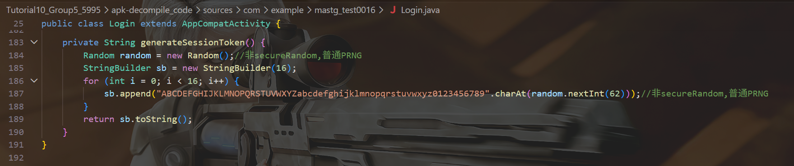

---

## D02 - Session token storage
**File:** `Login.java`  
**Search keyword:** `createSession`  
**Capture:** lines 174-176, `createSession()`  
**Save as:** `D02_login_createSession_storeToken.png`  
**Why it matters:** Proves the generated value is stored as `sessionToken` in persistent session state.  
**Supports:** `poc-notes`, reproduction notes, tutorial Q&A answers

**Image:**
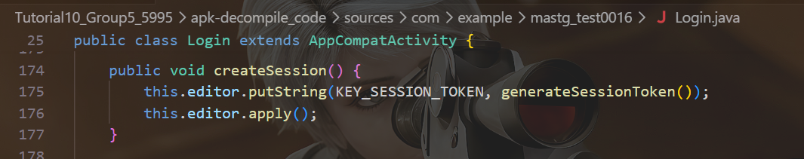

---

## D03 - Token accessor
**File:** `Login.java`  
**Search keyword:** `getSessionToken`  
**Capture:** lines 179-181, `getSessionToken()`  
**Save as:** `D03_login_getSessionToken_accessor.png`  
**Why it matters:** Shows the token is treated as retrievable internal state.  
**Supports:** `poc-notes`, tutorial Q&A answers

**Image:**
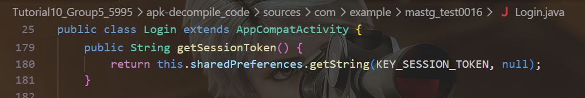

---

## D04 - Login success path to session creation
**File:** `Login.java`  
**Search keyword:** `checkCredentials`  
**Capture:** lines 52-59 in `onClick()`  
**Save as:** `D04_login_successPath_createSession_profile.png`  
**Why it matters:** Proves token creation is tied to successful authentication flow.  
**Supports:** `poc-notes`, attack steps, tutorial Q&A answers

**Image:**
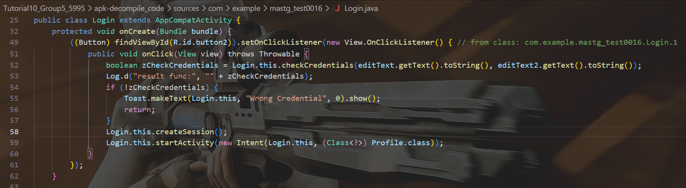

---

## D05 - Logout clears token
**File:** `Profile.java`  
**Search keyword:** `clearSession`  
**Capture:** lines 50-52, `clearSession()`  
**Save as:** `D05_profile_clearSession_removeToken.png`  
**Why it matters:** Shows the same token participates in session lifecycle and is not just a harmless random value.  
**Supports:** `poc-notes`, attack steps, tutorial Q&A answers

**Image:**
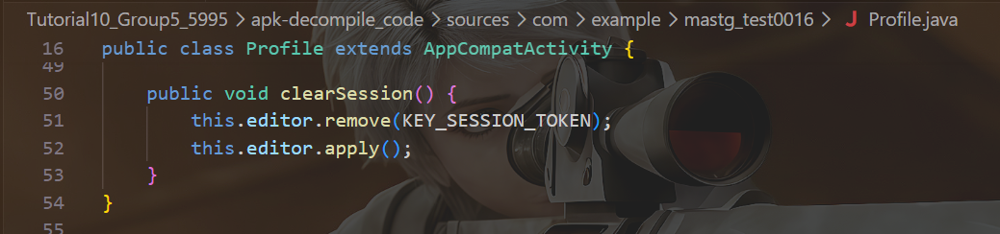

---

## D06 - Profile loads session state, no visible validation
**File:** `Profile.java`  
**Search keyword:** `onCreate`  
**Capture:** lines 21-39 in `onCreate()`  
**Save as:** `D06_profile_onCreate_noVisibleValidation.png`  
**Why it matters:** Supports the limitation statement: token storage/loading is visible, but no explicit validation sink is shown here.  
**Supports:** reproduction notes, tutorial Q&A answers

**Image:**
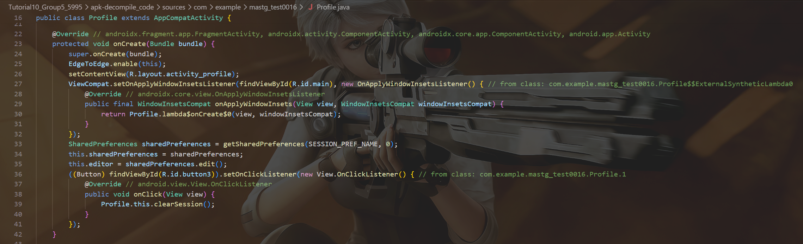

---

## D07 - Non-selected random usage
**File:** `MainActivity.java`  
**Search keyword:** `randomNumberGenerator`  
**Capture:** lines 17-20, `randomNumberGenerator()`  
**Save as:** `D07_main_randomNumberGenerator_nonSelected.png`  
**Why it matters:** Helps justify why the selected issue is the session-token path, not generic UI/debug randomness.  
**Supports:** `poc-notes`, tutorial Q&A answers

**Image:**
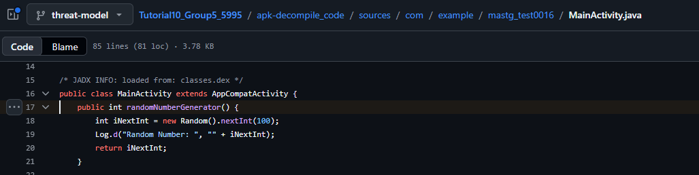

---

## D08 - Activity/export structure
**File:** `AndroidManifest.xml`  
**Search keyword:** `Profile`  
**Capture:** lines 28-37, activity declarations  
**Save as:** `D08_manifest_activity_exported_flags.png`  
**Why it matters:** Supports the bounded attacker model and shows no obvious exported shortcut into the protected flow.  
**Supports:** attack steps, reproduction notes, tutorial Q&A answers

**Image:**
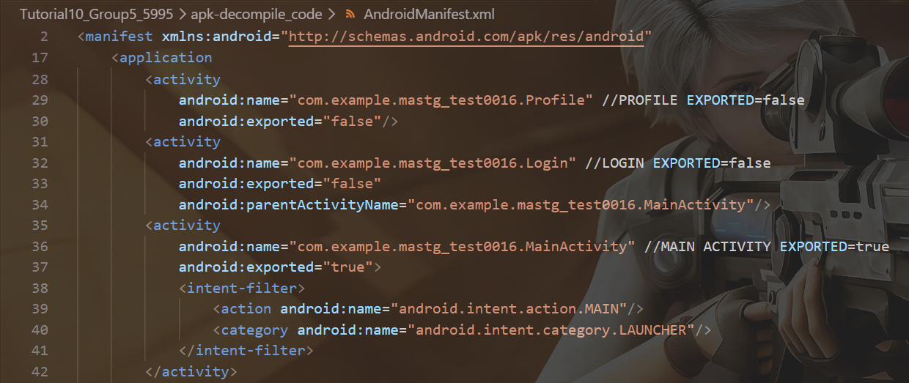

---

## D09 - All sessionToken hits
**File/Scope:** project-wide search in decompile tree  
**Search keyword:** `sessionToken`  
**Capture:** search results showing hits are limited to `Login.java` and `Profile.java`  
**Save as:** `D09_search_sessionToken_allHits.png`  
**Why it matters:** Best evidence-backed limitation for “no downstream token-validation sink currently shown in code.”  
**Supports:** `poc-notes`, reproduction notes, tutorial Q&A answers

**Image:**
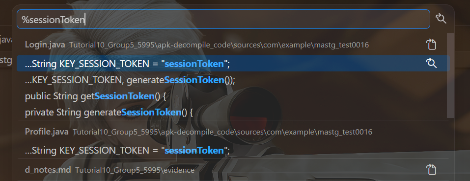

---

## D10 - Auth-state chain search
**File/Scope:** project-wide search in decompile tree  
**Search keyword:** `SESSION_PREF_NAME`  
**Also search if needed:** `KEY_SESSION_TOKEN`, `createSession`, `getSessionToken`, `clearSession`  
**Capture:** search results showing the auth-state chain  
**Save as:** `D10_search_sessionState_chain_SESSION_PREF_NAME.png`,`D10_search_sessionState_chain_KEY_SESSION_TOKEN.png`,`D10_search_sessionState_chain_createSession.png`,`D10_search_sessionState_chain_getSessionToken.png`,`D10_search_sessionState_chain_clearSession.png`
**Why it matters:** Gives one compact method-level evidence screenshot tying token generation, storage, retrieval, and clearing together.  
**Supports:** `poc-notes`, attack steps, tutorial Q&A answers

**Image:SESSION_PREF_NAME**
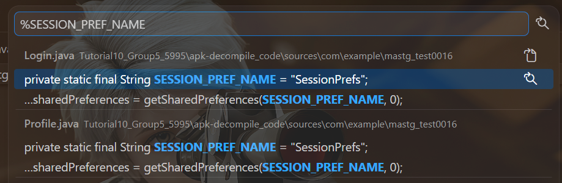
**Image:KEY_SESSION_TOKEN**
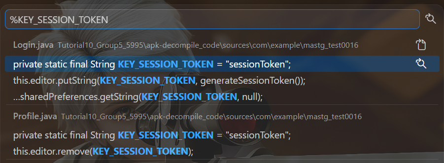
**Image:createSession**
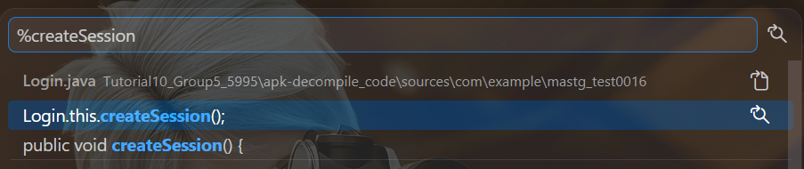
**Image:getSessionToken**
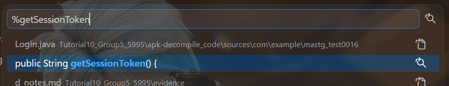
**Image:clearSession**
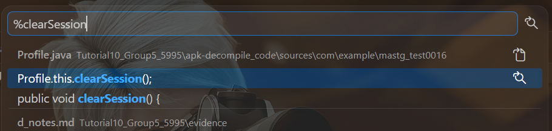

---

## D11 - Optional session constants and SharedPreferences setup
**File:** `Login.java`  
**Search keyword:** `SESSION_PREF_NAME`  
**Capture:** lines 26-29 and 44-45  
**Save as:** `D11_login_session_constants_sharedprefs.png`  
**Why it matters:** Compact screenshot showing the token/session naming and setup.  
**Supports:** `poc-notes`, tutorial Q&A answers

**Image:**
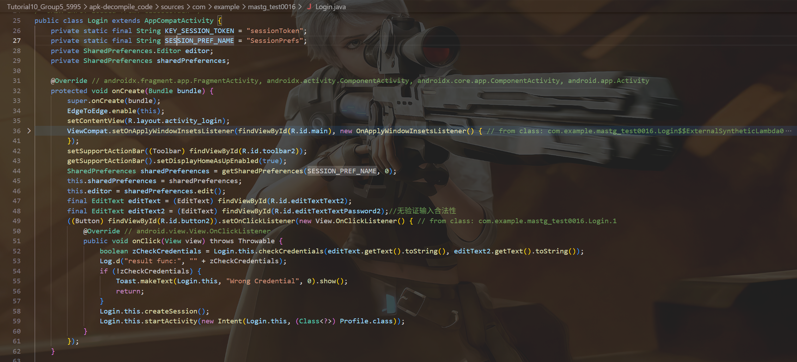

---

## Notes for D write-up
### Safe claim
The app generates authentication-related session state (`sessionToken`) using `java.util.Random`, stores it in `SharedPreferences`, and clears it on logout.

### Limitation
Current evidence shows weak session-token generation and storage, but does not show a downstream token-validation gate, so impact claims must remain bounded.

### Do not overclaim
- no guaranteed auth bypass
- no guaranteed session hijack
- no guaranteed replay success
- no guaranteed remote takeover

---