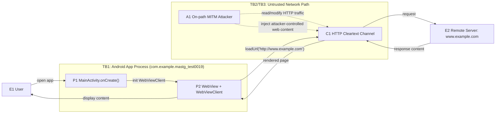

# System Model (Part A)

## Scope and Objective
- Target APK: `a2_case1.apk` (`com.example.mastg_test0019`).
- Part A graded class (per spec/rubric): insecure network transport/configuration enabling MITM.
- Chosen vulnerability for this submission: **cleartext traffic enabled + HTTP URL usage**.
- Focus of this model: app-to-network data flow for WebView HTTP content loading.

## Evidence Baseline (Decompiled)
- Network permission declared:
  - `export/resources/AndroidManifest.xml:13` -> `<uses-permission android:name="android.permission.INTERNET"/>`.
- Cleartext allowed in manifest:
  - `export/resources/AndroidManifest.xml:26` -> `android:usesCleartextTraffic="true"`.
- HTTP URL loaded directly:
  - `export/sources/com/example/mastg_test0019/MainActivity.java:38` -> `webView.loadUrl("http://www.example.com");`.

## Components
| ID | Component | Type | Responsibility |
|---|---|---|---|
| E1 | User | External Entity | Launches app and consumes rendered web content |
| P1 | MainActivity | Process | Initializes UI, WebView, and network-loading path |
| P2 | WebView + WebViewClient | Process | Fetches and renders remote web content |
| C1 | Network Channel (HTTP cleartext) | Data Flow Channel | Carries request/response between app and remote host |
| E2 | `www.example.com` | External Entity | Provides remote web content |
| A1 | On-path attacker (same Wi-Fi / rogue AP / ISP segment) | Threat Actor | Intercepts/modifies in-transit traffic |

## Trust Boundaries
- TB1: `User -> Android app process` (input and displayed content crossing app UI boundary).
- TB2: `App process -> network channel` (traffic leaves device sandbox and becomes network-exposed).
- TB3: `Untrusted network path -> remote server` (no transport encryption/authentication on HTTP path).

## Data Flow Diagram

## Asset Mapping (for Threat Linkage)
| Asset ID | Asset | Security Property | Why It Matters | Priority |
|---|---|---|---|---|
| AS1 | Web content shown in app WebView | Integrity, Authenticity | User trusts content as app-delivered content | Critical |
| AS2 | Request/response data in transit | Confidentiality, Integrity | Cleartext HTTP enables disclosure/tampering | High |
| AS3 | User decision context | Integrity | Manipulated content can drive phishing/social engineering | High |

## Rubric Alignment (Part A System & Threat Model, 3/3 target)
- Clear app/network model: components + trust boundaries + DFD included.
- Realistic on-path attacker: explicitly modeled on untrusted network path.
- Explicit linkage: attacker capabilities mapped to concrete protected assets (AS1-AS3).
