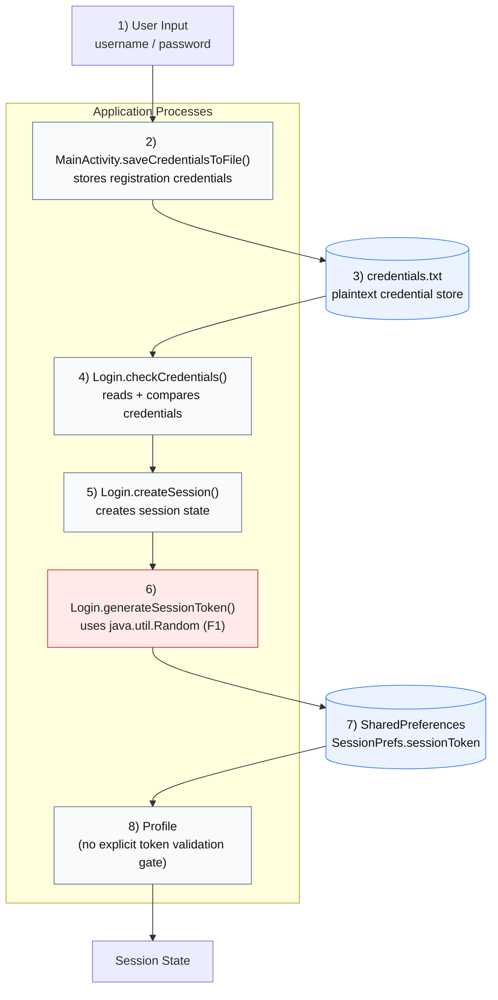

# System Model Diagram (Assignment Task 2)

The diagram below is aligned with the agreed C evidence flow and the selected F1 core vulnerability.

## Security Path Callout
`Random` -> `Token` -> `SharedPreferences` -> `Session`

## Figure Notes
- Core weak point: `Login.java` lines 183-188.
- Token persistence: `Login.java` lines 174-176.
- Supporting contrast (not core): `MainActivity.randomNumberGenerator()` (`MainActivity.java` lines 17-20).
