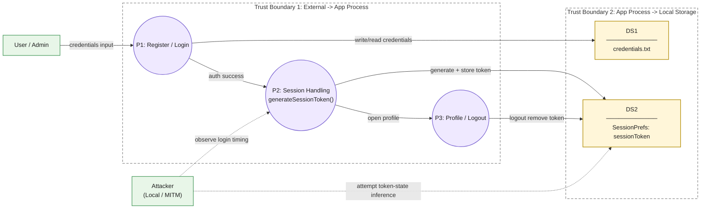

# System Model Diagram

Unified horizontal diagram with style matching the preferred version.

## Figure Notes
- Data flow aligned with agreed chain: `User input -> MainActivity.saveCredentialsToFile -> credentials.txt -> Login.checkCredentials -> Login.createSession -> Login.generateSessionToken -> SharedPreferences(sessionToken) -> Profile`.
- Core security path: `Random -> Token -> SharedPreferences -> Session`.
- Code anchors: `Login.java` 174-176 and 183-188, `MainActivity.java` 17-20, `Profile.java` 50-52.
