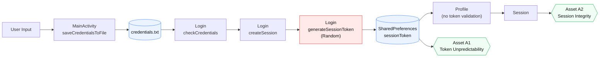

# System Model Diagram (Assignment Task 2)

Horizontal diagram with explicit main components, core assets, and data flow (aligned with F1).

## Node Notes (for readability)
- `MainActivity.saveCredentialsToFile`: writes credentials to `credentials.txt`.
- `Login.checkCredentials`: reads and compares stored credentials.
- `Login.createSession`: creates auth session state.
- `Login.generateSessionToken (Random)`: selected F1 weak randomness point.
- `SharedPreferences(sessionToken)`: persistent token store.
- `Profile (no token validation)`: no explicit token validation gate shown in observed flow.

## Security Path
`Random -> Token -> SharedPreferences -> Session`

## Evidence Anchors
- `Login.java` lines 183-188 (weak token generation)
- `Login.java` lines 174-176 (token persistence)
- `MainActivity.java` lines 17-20 (UI-only random contrast)
