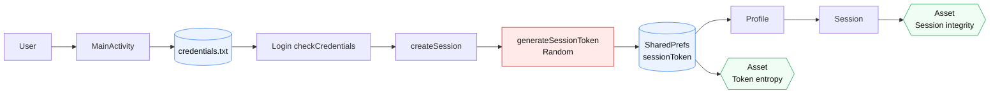

# System Model Diagram

Compact horizontal diagram for single-column report layout.

## Figure Notes
- Main flow: `User -> MainActivity -> credentials.txt -> Login.checkCredentials -> createSession -> generateSessionToken(Random) -> SharedPreferences(sessionToken) -> Profile -> Session`.
- Core security path: `Random -> Token -> SharedPreferences -> Session`.
- Code anchors: `Login.java` 174-176, 183-188; `Profile.java` 50-52.
- Contrast (not core): `MainActivity.java` 17-20 is UI-only random usage.

## LaTeX Placement Tip
Use one-column figure width:
`\\includegraphics[width=\\columnwidth]{system-model-diagram}`
