# System Model Diagram (Assignment Task 2)

Richer horizontal system model with main components, core assets, end-to-end data flow, and code anchors.

```mermaid
flowchart LR
    %% Actors and components
    U["User Input\n(username/password)"]
    MA["MainActivity\nsaveCredentialsToFile()"]
    LC["Login\ncheckCredentials()"]
    CS["Login\ncreateSession()"]
    GST["Login\ngenerateSessionToken()\nuses Random"]
    PF["Profile\n(no explicit token validation)"]

    %% Data stores and state
    CRED[("credentials.txt\nplaintext store")]
    SP[("SharedPreferences\nSessionPrefs.sessionToken")]
    S["Session State"]

    %% Core assets
    A1{{"Asset A1\nToken Unpredictability"}}
    A2{{"Asset A2\nAuthentication-State Integrity"}}

    %% Data flow (aligned with C evidence)
    U -->|register input| MA
    MA -->|write credentials| CRED
    CRED -->|read credentials| LC
    LC -->|valid login| CS
    CS -->|invoke token generation| GST
    GST -->|store token| SP
    SP -->|session token available| PF
    PF -->|effective logged-in state| S

    %% Asset linkage
    SP --> A1
    S --> A2

    %% Code anchors
    E1["Code Anchor\nLogin.java 183-188\nRandom token generation"]
    E2["Code Anchor\nLogin.java 174-176\nstore sessionToken"]
    E3["Code Anchor\nProfile.java 50-52\nclearSession()"]
    E4["Contrast Anchor\nMainActivity.java 17-20\nUI-only random"]

    E1 -. evidence .-> GST
    E2 -. evidence .-> SP
    E3 -. evidence .-> PF
    E4 -. contrast .-> MA

    classDef vuln fill:#ffe9e9,stroke:#cc3333,stroke-width:1px,color:#111;
    classDef store fill:#eaf3ff,stroke:#3b82f6,stroke-width:1px,color:#111;
    classDef asset fill:#f0fdf4,stroke:#16a34a,stroke-width:1px,color:#111;
    classDef anchor fill:#fff7ed,stroke:#f97316,stroke-width:1px,color:#111;

    class GST vuln;
    class CRED,SP store;
    class A1,A2 asset;
    class E1,E2,E3,E4 anchor;
```

## Security Path
`Random -> Token -> SharedPreferences -> Session`

## Mapping to Assignment Wording
- Main components: `MainActivity`, `Login`, `Profile`
- Key assets: token unpredictability, authentication-state integrity
- Key data flows: registration -> credentials store -> login check -> session creation -> token persistence -> profile/session
