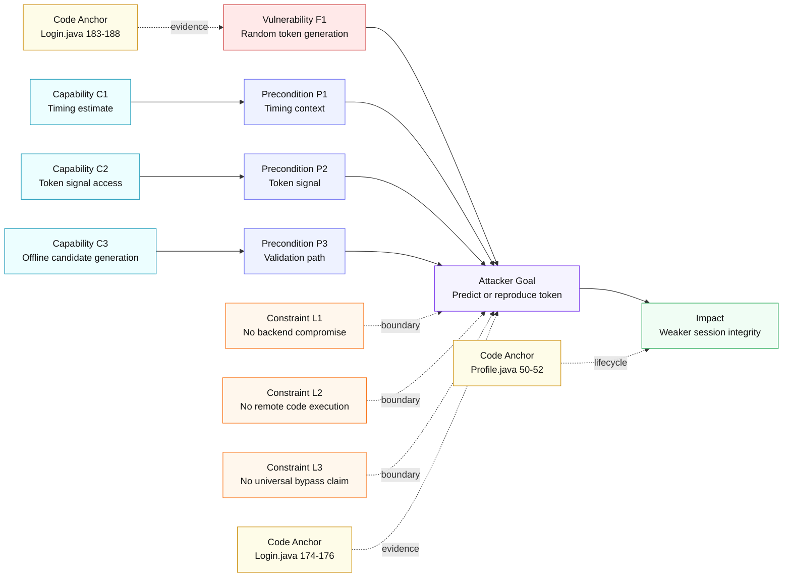

# Threat Model Abstract Diagram (Draft Backup)

Previous abstract threat-relationship view, kept as report backup draft.

```mermaid
flowchart LR
    V["Vulnerability F1<br/>Random token generation"]

    C1["Capability C1<br/>Timing estimate"]
    C2["Capability C2<br/>Token signal access"]
    C3["Capability C3<br/>Offline candidate generation"]

    P1["Precondition P1<br/>Timing context"]
    P2["Precondition P2<br/>Token signal"]
    P3["Precondition P3<br/>Validation path"]

    G["Attacker Goal<br/>Predict or reproduce token"]
    I["Impact<br/>Weaker session integrity"]

    L1["Constraint L1<br/>No backend compromise"]
    L2["Constraint L2<br/>No remote code execution"]
    L3["Constraint L3<br/>No universal bypass claim"]

    K1["Code Anchor<br/>Login.java 183-188"]
    K2["Code Anchor<br/>Login.java 174-176"]
    K3["Code Anchor<br/>Profile.java 50-52"]

    V --> G
    C1 --> P1 --> G
    C2 --> P2 --> G
    C3 --> P3 --> G
    G --> I

    L1 -. boundary .-> G
    L2 -. boundary .-> G
    L3 -. boundary .-> G

    K1 -. evidence .-> V
    K2 -. evidence .-> G
    K3 -. lifecycle .-> I

    classDef vuln fill:#ffe9e9,stroke:#cc3333,stroke-width:1px,color:#111;
    classDef cap fill:#ecfeff,stroke:#0891b2,stroke-width:1px,color:#111;
    classDef pre fill:#eef2ff,stroke:#6366f1,stroke-width:1px,color:#111;
    classDef goal fill:#f5f3ff,stroke:#7c3aed,stroke-width:1px,color:#111;
    classDef impact fill:#f0fdf4,stroke:#16a34a,stroke-width:1px,color:#111;
    classDef limit fill:#fff7ed,stroke:#f97316,stroke-width:1px,color:#111;
    classDef anchor fill:#fefce8,stroke:#ca8a04,stroke-width:1px,color:#111;

    class V vuln;
    class C1,C2,C3 cap;
    class P1,P2,P3 pre;
    class G goal;
    class I impact;
    class L1,L2,L3 limit;
    class K1,K2,K3 anchor;
```
