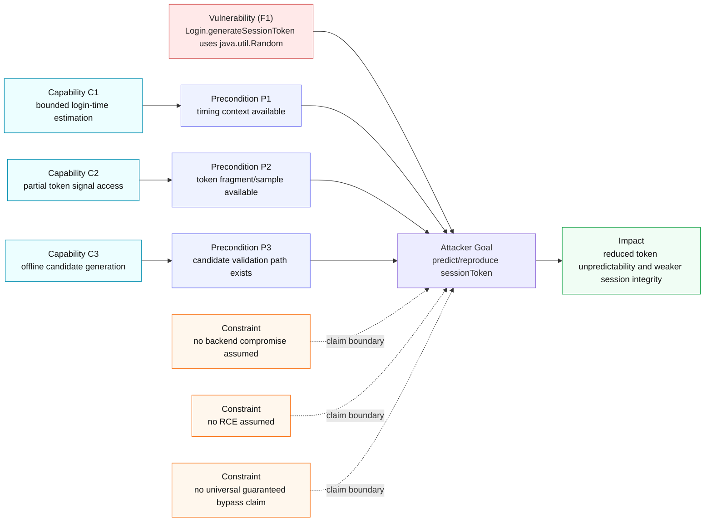

# Threat Model Diagram (F1)

This threat model explicitly links attacker goals/capabilities to the chosen F1 vulnerability.

## Reading Guide
- Vulnerability source: `Login.java` lines 183-188.
- Security path in system model: `Random -> Token -> SharedPreferences -> Session`.
- This diagram keeps claims realistic and bounded for tutorial defense.
