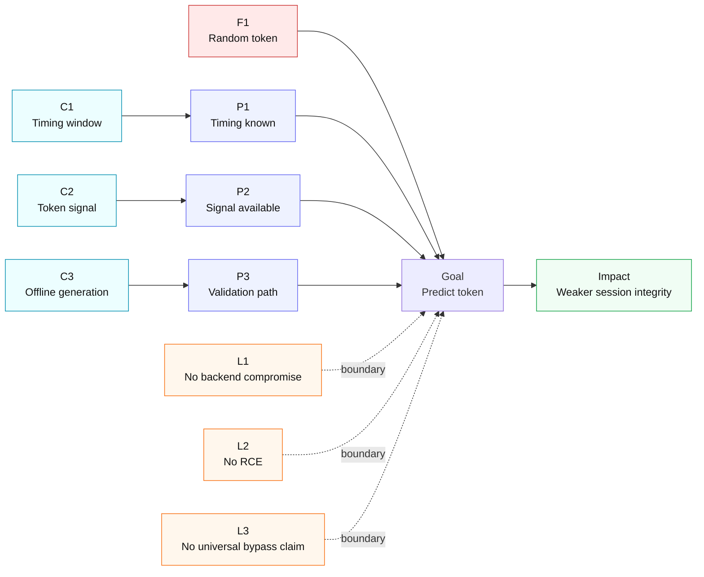

# Threat Model Diagram

Compact horizontal diagram with the same style as the first version.

## Figure Notes
- F1 code anchor: `Login.generateSessionToken()` uses `Random` in `Login.java` 183-188.
- Session persistence anchor: `Login.java` 174-176.
- Lifecycle anchor: `Profile.java` 50-52.
- Interpretation: risk claim is conditional on P1-P3 and bounded by L1-L3.

## LaTeX Placement Tip
Use one-column figure width:
`\\includegraphics[width=\\columnwidth]{threat-model-diagram}`
