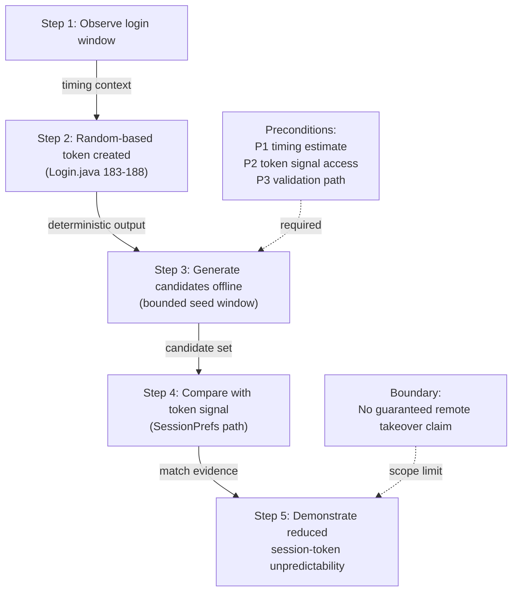

# Attack Path Diagram (Threat Model)

Compact 5-step attack path focused on the selected vulnerability.

## Short Explanation
1. The vulnerability is on the token-generation point in `Login.generateSessionToken()` using `java.util.Random`.
2. Under bounded timing knowledge, deterministic candidate generation becomes plausible in local-analysis conditions.
3. If candidate validation is available, attacker can demonstrate weaker token unpredictability.
4. This supports a bounded threat claim on authentication-state integrity, not a universal remote bypass claim.

## LaTeX Placement Tip
Use one-column figure width:
`\\includegraphics[width=\\columnwidth]{attack-path-diagram}`
