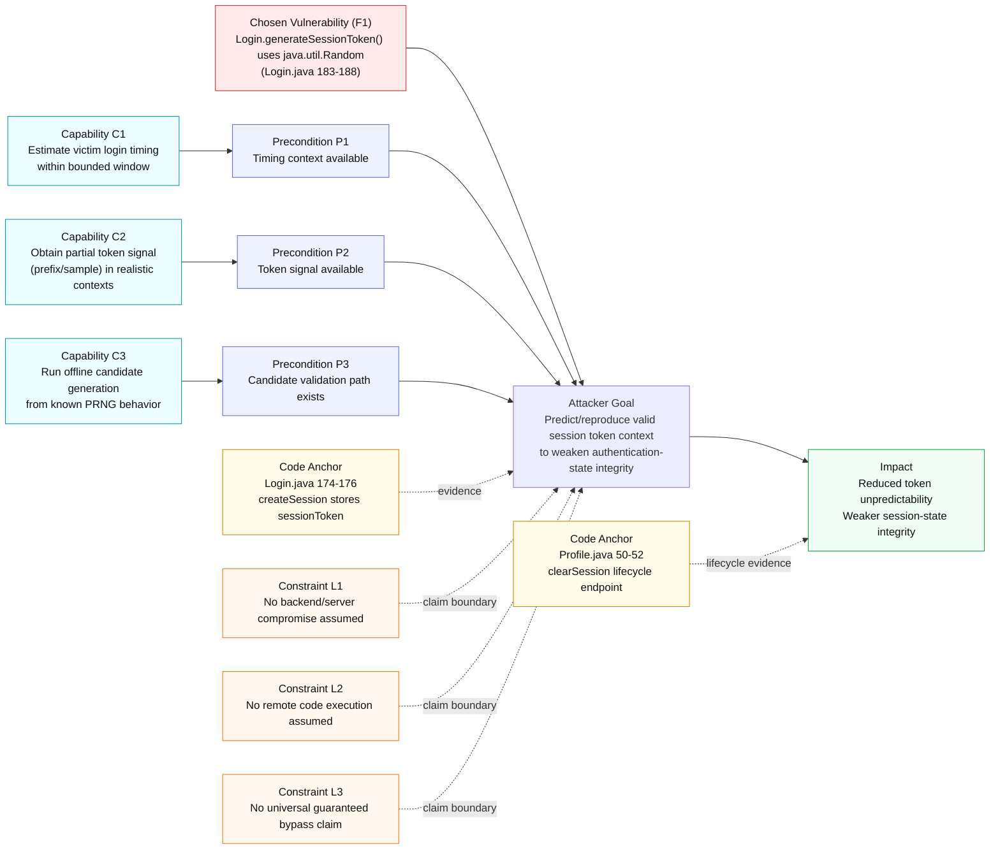

# Threat Model Diagram (F1)

Detailed horizontal threat model with explicit preconditions, capabilities, constraints, impact, and code anchors.

## Threat Logic Summary
- Vulnerability is directly linked to token generation in auth path.
- Attack claim is bounded by explicit capabilities/preconditions.
- Constraints are part of the model to avoid over-claiming.
