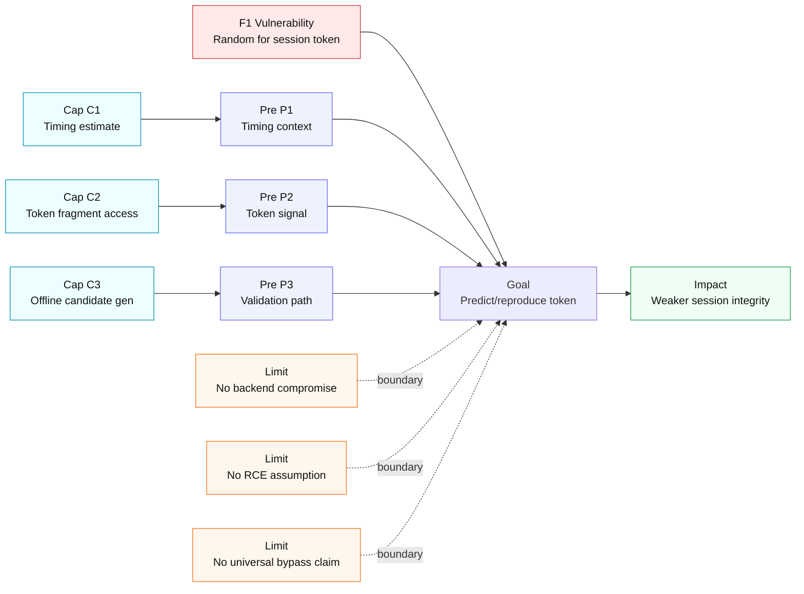

# Threat Model Diagram (F1)

Horizontal threat model with concise labels to avoid clipping.

## Node Notes
- `F1 Vulnerability`: `Login.generateSessionToken()` uses `java.util.Random` (`Login.java` 183-188).
- `Goal`: predict or reproduce valid session token context.
- `Impact`: reduced token unpredictability and weaker session-state integrity.
- `Limits`: bounded claims for tutorial defense (no overstatement).
