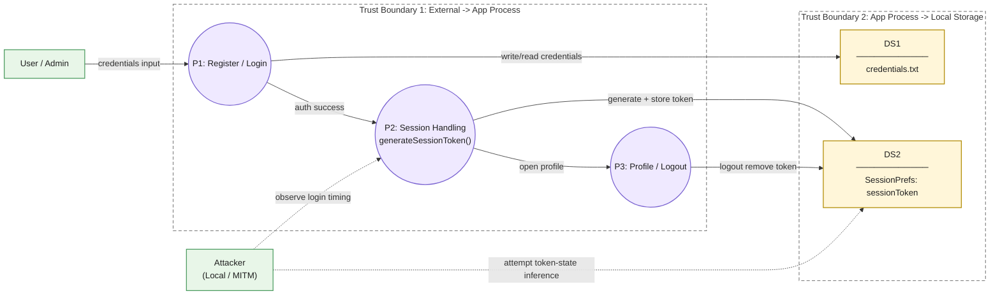

# System Model (Core Result, Refined Draft)

## A. App Summary (3-5 sentences)
This APK is a local Android demo app with three key activities: `MainActivity` (register), `Login` (credential check + session creation), and `Profile` (post-login page + logout). User credentials are written to a local file (`credentials.txt`), and login session state is persisted in `SharedPreferences("SessionPrefs")` as `sessionToken`. The selected security issue is **randomness misuse in session token generation (predictable PRNG risk)** in `Login.generateSessionToken()`. The app evidence shows local auth-state creation and storage clearly, but does not show backend-side token validation logic. Therefore, this model focuses on token-generation security properties and bounded local exploitability claims.

## B. Scope and Selected Vulnerability
Selected core vulnerability:
- F1: `Login.generateSessionToken()` uses `java.util.Random` for session token generation (`Login.java` 183-188).

Scope rationale:
1. Directly in randomness/crypto marking scope.
2. Located on authentication-state creation path (`createSession()` -> `sessionToken` persistence).
3. Strongest evidence-backed path among observed random usages.

Code anchors:
- Token generation: `apk-decompile_code/sources/com/example/mastg_test0016/Login.java` 183-188.
- Token persistence: `Login.java` 174-176.
- Login success to profile: `Login.java` 52-59.
- Logout token removal: `apk-decompile_code/sources/com/example/mastg_test0016/Profile.java` 50-52.

## C. DFD (with Trust Boundaries)

## D. Main Components and Data Flow
Processes:
1. `P1 MainActivity`: collect registration input and write plaintext credentials (`saveCredentialsToFile()`).
2. `P2 Login`: validate credentials, generate token, and persist `sessionToken`.
3. `P3 Profile`: represent logged-in state and clear token on logout.

Data stores:
1. `DS1 credentials.txt`: local file containing credential records.
2. `DS2 SharedPreferences(SessionPrefs)`: local session-state store.

Critical security data flow:
- `P2.generateSessionToken()` -> `P2.createSession()` -> `DS2.sessionToken`.

Linear end-to-end data-flow chain (report-friendly):
- `User input` -> `MainActivity.saveCredentialsToFile()` -> `credentials.txt` -> `Login.checkCredentials()` -> `Login.createSession()` -> `Login.generateSessionToken()` -> `SharedPreferences(SessionPrefs.sessionToken)` -> `Profile`.

## E. Key Assets and Security Role
Primary assets:
1. `sessionToken` unpredictability (auth-state secret quality).
2. Authentication-state integrity (who is treated as logged in).

Supporting assets:
1. Stored credential data in `DS1`.
2. Session lifecycle state in `DS2`.
3. Token generation logic in `P2`.

## F. Core Assumptions and Attacker Goals
Core assumptions:
1. Attacker can estimate login timing within a bounded window.
2. Attacker can observe/read token state in realistic local-analysis conditions.
3. Attacker can run offline candidate generation and attempt validation.

Attacker goals:
1. Predict or reproduce valid `sessionToken` candidates.
2. Undermine auth-state integrity through token predictability.

## G. Boundaries of Claim and Risk Acceptance
What we claim:
1. Session token generation uses predictable PRNG in a security-sensitive path.
2. This weakens intended unpredictability of authentication-related state.

What we do not claim:
1. No guaranteed remote takeover claim.
2. No server-compromise claim (no backend evidence shown in APK).
3. No elevation of unrelated issues (e.g., plaintext credentials) to the selected core vulnerability.

Risk acceptance statement:
- For this iteration, we accept bounded impact claims when downstream token-validation evidence is incomplete, while still treating predictable token generation as a valid design flaw.

## H. B -> E Handoff Constraints
1. Replace `Random` with `SecureRandom` in `Login.generateSessionToken()`.
2. Increase token entropy (length and/or encoding strategy).
3. Keep impact language bounded unless new downstream validation evidence is added.
