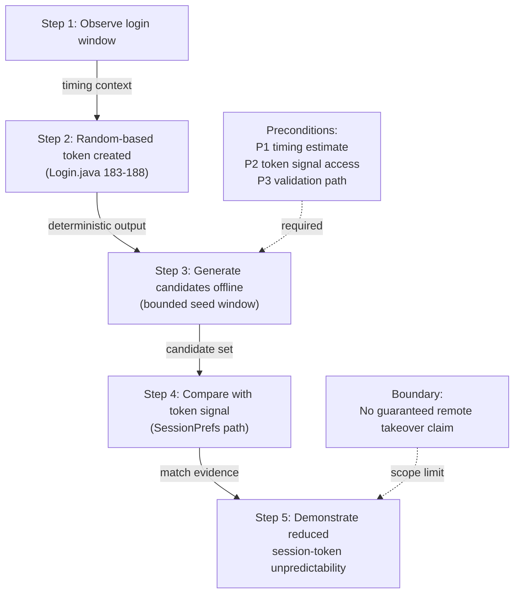

# Threat Model (Core Result, Refined Draft)

## A. Threat Linked to Selected Vulnerability
Selected issue:
- `Login.generateSessionToken()` uses `java.util.Random` (`Login.java` 183-188) to generate authentication-related token material.

Threat statement:
- The security role of `sessionToken` requires unpredictability, but deterministic PRNG output can be modeled under timing-informed conditions.
- This creates a credible predictability threat on the auth-state path (`P2 -> DS2`), even when impact claims are bounded.

## B. Randomness Evaluation Focus
### B1. Random Space Analysis
1. Observed token construction: 16 chars from 62-character alphabet (`nextInt(62)` loop).
2. Naive combinational space is `62^16`, but practical attack cost depends on effective seed search, not only output alphabet size.
3. Therefore, space size alone is insufficient as a security argument if seed predictability can collapse candidate generation.

### B2. Seed Predictability Analysis
1. `java.util.Random` is deterministic and not a CSPRNG for token security.
2. If token creation time is approximated, attacker can prioritize candidate generation around constrained seed windows.
3. The exploitability threshold is driven by available timing precision + observable validation signals.

## C. Attacker Personas (External / Internal / MITM)
1. External attacker (low feasibility in current evidence):
- No backend/API token protocol shown in APK.
- Cannot be primary model for this specific token path.

2. Internal/local attacker (primary model):
- Rooted-device user, emulator analyst, instrumentation/debugging user.
- Can observe login timing and inspect/compare local token state.

3. MITM attacker (context-dependent, currently low relevance):
- Network observer model is not primary because this APK evidence does not show token transmission over network.

## D. Attack Surface and Threat Location on DFD
Attack surfaces:
1. `P2 Login` token generation logic.
2. Data flow from `P2` to `DS2` (`generateSessionToken()` -> `createSession()` -> persistent `sessionToken`).
3. Session lifecycle flow from `P3` to `DS2` (token removal).

Threat location mapping:
1. Component-level: `P2 Login`.
2. Data-flow-level: `P2 -> DS2`.
3. Asset-level: `DS2.sessionToken` and auth-state integrity.

## E. Attack Preconditions and Outcome Matrix
P1. Login timing can be estimated in a bounded window.
P2. Token state (or equivalent signal) is observable in realistic local-analysis conditions.
P3. Candidate validation path exists (direct token comparison or behavior check).

Outcome mapping:
1. P1 + P2: candidate enumeration becomes plausible.
2. P1 + P2 + P3: bounded validation attempt becomes plausible.
3. Missing any of P1/P2/P3: practical exploitation weakens, but design flaw claim remains.

## F. Short, Concrete Attack Path
1. Attacker observes victim login event and narrows likely token-generation time.
2. `P2` generates token using `new Random()` and 16-char loop.
3. Attacker reproduces token candidates using deterministic generator behavior around bounded timing window.
4. Attacker compares candidates against observed token state/signal in local analysis environment.
5. If matched, attacker demonstrates reduced token unpredictability on auth-state material.

## G. Attack Path Diagram

## H. Assumptions and Risk Acceptance
Assumptions:
1. Local-analysis capability is realistic for assignment context.
2. Timing side-information can be estimated with bounded error.
3. No backend compromise is assumed.

Risk acceptance:
1. We accept bounded impact wording where downstream token enforcement evidence is incomplete.
2. We do not accept predictable PRNG for security token generation as safe design.

## I. Why This Model Is Defensible
1. It evaluates both random-space and seed-predictability dimensions.
2. It declares attacker personas with feasibility boundaries.
3. It maps threat to explicit DFD node/data-flow locations.
4. It avoids over-claiming while preserving a valid security finding.
